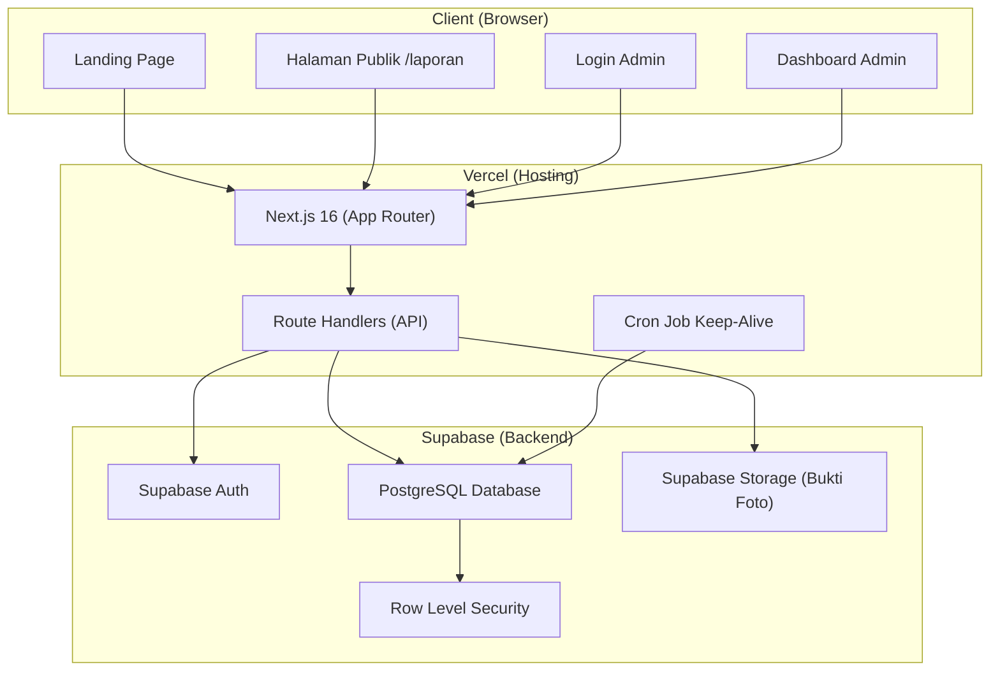
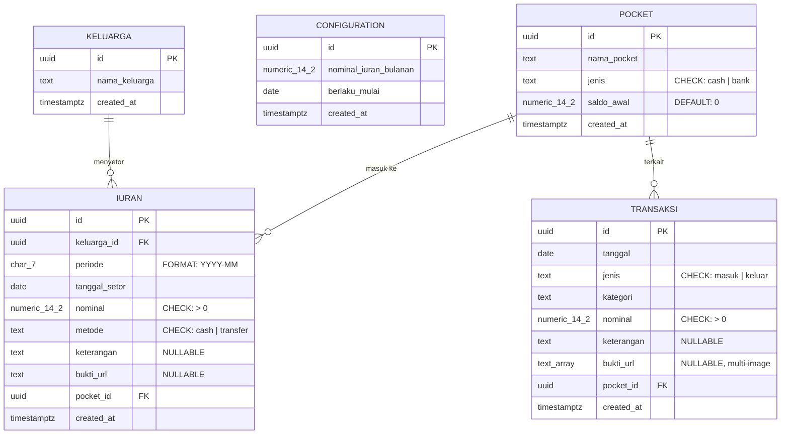
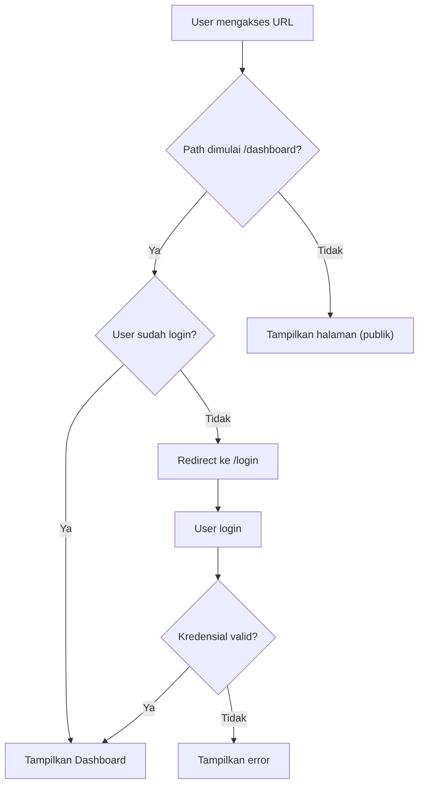
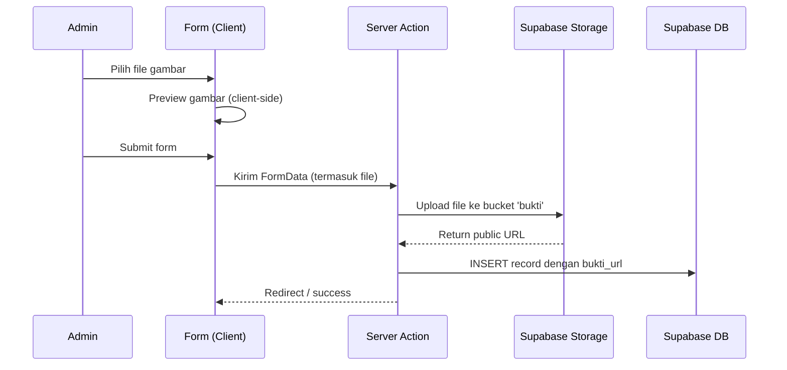

<!-- BEGIN:nextjs-agent-rules -->

# This is NOT the Next.js you know

This version has breaking changes — APIs, conventions, and file structure may all differ from your training data. Read the relevant guide in `node_modules/next/dist/docs/` before writing any code. Heed deprecation notices.

<!-- END:nextjs-agent-rules -->

---

# SRS: MLAKUBARENG

**Software Requirements Specification — Aplikasi Kas Keluarga Transparan**

Versi: 0.1 (Draft)
Tanggal: 2 Agustus 2026
Referensi: [PRD-Mlaku Bareng-Pocket.md](file:///D:/My%20Project/MlakuBareng/mlakubareng/PRD-Mlaku Bareng-Pocket.md) | [001_init.sql](file:///D:/My%20Project/MlakuBareng/mlakubareng/001_init.sql)

---

## Daftar Isi

1. [Pendahuluan](#1-pendahuluan)
2. [Arsitektur Sistem](#2-arsitektur-sistem)
3. [Tech Stack & Versi](#3-tech-stack--versi)
4. [Struktur Proyek (Next.js App Router)](#4-struktur-proyek-nextjs-app-router)
5. [Model Data & Database Schema](#5-model-data--database-schema)
6. [Supabase Client Setup](#6-supabase-client-setup)
7. [Autentikasi & Otorisasi](#7-autentikasi--otorisasi)
8. [API Endpoints (Route Handlers)](#8-api-endpoints-route-handlers)
9. [Halaman & Komponen UI](#9-halaman--komponen-ui)
10. [Business Logic & Aturan Bisnis](#10-business-logic--aturan-bisnis)
11. [Upload File (Bukti Transaksi)](#11-upload-file-bukti-transaksi)
12. [Export Laporan (PDF & Excel)](#12-export-laporan-pdf--excel)
13. [Cron Job Keep-Alive](#13-cron-job-keep-alive)
14. [Non-Functional Requirements](#14-non-functional-requirements)
15. [Fase Implementasi](#15-fase-implementasi)
16. [Konvensi Kode](#16-konvensi-kode)

---

## 1. Pendahuluan

### 1.1 Tujuan Dokumen

Dokumen ini menerjemahkan PRD MLAKUBARENG menjadi spesifikasi teknis yang siap diimplementasikan. Semua keputusan arsitektur, struktur file, API contract, dan detail komponen didokumentasikan di sini sebagai **satu-satunya sumber kebenaran teknis** bagi developer.

### 1.2 Lingkup Sistem

MLAKUBARENG adalah aplikasi web kas keluarga yang:

- Dioperasikan oleh **1 Admin** (bendahara) untuk mencatat iuran & transaksi kas.
- Menyediakan **halaman publik transparan** (tanpa login) agar semua anggota keluarga bisa melihat status kas.
- Berjalan **gratis (Rp0/bulan)** menggunakan free tier Vercel + Supabase.

### 1.3 Definisi & Akronim

| Istilah       | Definisi                                                            |
| ------------- | ------------------------------------------------------------------- |
| **KK**        | Kepala Keluarga — unit data member, bukan akun pengguna             |
| **Pocket**    | Dompet/wadah penyimpanan uang (Cash, Bank, E-wallet)                |
| **Iuran**     | Setoran bulanan per KK ke kas keluarga                              |
| **Transaksi** | Catatan kas masuk/keluar umum (di luar iuran)                       |
| **RLS**       | Row Level Security — fitur PostgreSQL untuk kontrol akses per baris |
| **SSR**       | Server-Side Rendering                                               |
| **RSC**       | React Server Components                                             |

---

## 2. Arsitektur Sistem



### 2.1 Prinsip Arsitektur

1. **Server-first**: Gunakan React Server Components (RSC) sebagai default. Client Components (`'use client'`) hanya untuk interaktivitas (form, state, event handler).
2. **Supabase sebagai Backend**: Tidak ada backend custom — semua data lewat Supabase client (JS SDK).
3. **RLS sebagai security layer**: Semua akses data dikontrol via RLS policy di database level.
4. **Thin API layer**: Route Handlers (`app/api/`) hanya untuk operasi yang butuh server-side logic (upload file, export PDF, cron).

---

## 3. Tech Stack & Versi

| Komponen     | Teknologi                          | Versi     | Catatan                         |
| ------------ | ---------------------------------- | --------- | ------------------------------- |
| Framework    | Next.js                            | 16.2.12   | App Router, RSC                 |
| UI Library   | React                              | 19.2.4    |                                 |
| Language     | TypeScript                         | ^5        | Strict mode enabled             |
| Styling      | Tailwind CSS                       | ^4        | Dengan `@tailwindcss/postcss`   |
| Database     | PostgreSQL (Supabase)              | 15+       | Free tier, 500MB                |
| Auth         | Supabase Auth                      | Latest    | Email/password, 1 admin account |
| Storage      | Supabase Storage                   | Latest    | Free tier, 1GB                  |
| PDF Export   | `@react-pdf/renderer` atau `jspdf` | Latest    | Client-side generation          |
| Excel Export | `sheetjs` (`xlsx`)                 | Latest    | Client-side generation          |
| Hosting      | Vercel                             | Free tier | Auto-deploy dari GitHub         |

### 3.1 Dependencies yang Perlu Diinstall

```bash
# Runtime dependencies
npm install @supabase/supabase-js @supabase/ssr
npm install jspdf jspdf-autotable
npm install xlsx
npm install date-fns               # utility tanggal, format periode, dsb
npm install lucide-react            # icon library (ringan, tree-shakable)

# Dev dependencies (opsional tapi disarankan)
npm install -D @types/jspdf
```

---

## 4. Struktur Proyek (Next.js App Router)

```
mlakubareng/
├── app/
│   ├── layout.tsx                          # Root layout (font, metadata global)
│   ├── globals.css                         # Global styles + Tailwind
│   ├── page.tsx                            # Landing Page (/)
│   │
│   ├── laporan/
│   │   └── page.tsx                        # Transparansi Publik (/laporan)
│   │
│   ├── login/
│   │   └── page.tsx                        # Login Admin (/login)
│   │
│   ├── dashboard/
│   │   ├── layout.tsx                      # Dashboard layout (sidebar, auth guard)
│   │   ├── page.tsx                        # Dashboard Overview (/dashboard)
│   │   │
│   │   ├── keluarga/
│   │   │   ├── page.tsx                    # List Keluarga
│   │   │   ├── tambah/
│   │   │   │   └── page.tsx               # Tambah Keluarga
│   │   │   └── [id]/
│   │   │       ├── page.tsx               # Detail Keluarga
│   │   │       └── edit/
│   │   │           └── page.tsx           # Edit Keluarga
│   │   │
│   │   ├── iuran/
│   │   │   ├── page.tsx                    # List Iuran
│   │   │   ├── tambah/
│   │   │   │   └── page.tsx               # Tambah Iuran
│   │   │   └── [id]/
│   │   │       ├── page.tsx               # Detail Iuran
│   │   │       └── edit/
│   │   │           └── page.tsx           # Edit Iuran
│   │   │
│   │   ├── transaksi/
│   │   │   ├── page.tsx                    # List Transaksi
│   │   │   ├── tambah/
│   │   │   │   └── page.tsx               # Tambah Transaksi
│   │   │   └── [id]/
│   │   │       ├── page.tsx               # Detail Transaksi
│   │   │       └── edit/
│   │   │           └── page.tsx           # Edit Transaksi
│   │   │
│   │   ├── pocket/
│   │   │   ├── page.tsx                    # List Pocket
│   │   │   ├── tambah/
│   │   │   │   └── page.tsx               # Tambah Pocket
│   │   │   └── [id]/
│   │   │       ├── page.tsx               # Detail Pocket
│   │   │       └── edit/
│   │   │           └── page.tsx           # Edit Pocket
│   │   │
│   │   ├── laporan/
│   │   │   └── page.tsx                   # Export Laporan (PDF/Excel)
│   │   │
│   │   └── settings/
│   │       └── page.tsx                   # Settings (nominal iuran, dll)
│   │
│   └── api/
│       ├── cron/
│       │   └── keep-alive/
│       │       └── route.ts               # Cron job keep-alive Supabase
│       └── export/
│           ├── pdf/
│           │   └── route.ts               # Generate & stream PDF
│           └── excel/
│               └── route.ts               # Generate & stream Excel
│
├── components/
│   ├── ui/                                 # Reusable UI primitives
│   │   ├── button.tsx
│   │   ├── card.tsx
│   │   ├── input.tsx
│   │   ├── select.tsx
│   │   ├── table.tsx
│   │   ├── badge.tsx
│   │   ├── dialog.tsx
│   │   ├── toast.tsx
│   │   └── skeleton.tsx
│   │
│   ├── layout/                             # Layout components
│   │   ├── sidebar.tsx
│   │   ├── header.tsx
│   │   ├── mobile-nav.tsx
│   │   └── page-header.tsx
│   │
│   ├── forms/                              # Form components
│   │   ├── keluarga-form.tsx
│   │   ├── iuran-form.tsx
│   │   ├── transaksi-form.tsx
│   │   ├── pocket-form.tsx
│   │   └── file-upload.tsx
│   │
│   ├── tables/                             # Table/data display components
│   │   ├── keluarga-table.tsx
│   │   ├── iuran-table.tsx
│   │   ├── transaksi-table.tsx
│   │   ├── pocket-table.tsx
│   │   └── status-iuran-grid.tsx           # Grid status setoran per KK per bulan
│   │
│   └── charts/                             # Chart components (Fase 2)
│       ├── saldo-chart.tsx
│       └── iuran-progress-chart.tsx
│
├── lib/
│   ├── supabase/
│   │   ├── client.ts                       # Supabase client (browser)
│   │   ├── server.ts                       # Supabase client (server/RSC)
│   │   ├── middleware.ts                   # Auth session refresh
│   │   └── types.ts                        # Generated database types
│   │
│   ├── utils/
│   │   ├── format.ts                       # Format Rupiah, tanggal, periode
│   │   ├── constants.ts                    # Kategori transaksi, metode, dsb
│   │   └── validators.ts                   # Validasi form (zod schemas)
│   │
│   └── actions/                            # Server Actions
│       ├── keluarga.ts
│       ├── iuran.ts
│       ├── transaksi.ts
│       ├── pocket.ts
│       ├── configuration.ts
│       └── auth.ts
│
├── middleware.ts                            # Next.js middleware (auth redirect)
│
├── 001_init.sql                            # Migration SQL
├── PRD-Mlaku Bareng-Pocket.md                  # Product Requirements Document
├── SRS-Mlaku Bareng-Pocket.md                  # Dokumen ini
├── AGENTS.md                               # Agent rules
├── package.json
├── tsconfig.json
├── next.config.ts
├── postcss.config.mjs
└── eslint.config.mjs
```

---

## 5. Model Data & Database Schema

### 5.1 Entity Relationship Diagram



### 5.2 Database Views

#### `v_saldo_pocket` — Saldo Otomatis per Pocket

```sql
CREATE OR REPLACE VIEW v_saldo_pocket AS
SELECT
    p.id AS pocket_id,
    p.nama_pocket,
    p.jenis,
    p.saldo_awal
        + COALESCE((SELECT SUM(i.nominal) FROM iuran i WHERE i.pocket_id = p.id), 0)
        + COALESCE((SELECT SUM(t.nominal) FROM transaksi t WHERE t.pocket_id = p.id AND t.jenis = 'masuk'), 0)
        - COALESCE((SELECT SUM(t.nominal) FROM transaksi t WHERE t.pocket_id = p.id AND t.jenis = 'keluar'), 0)
    AS saldo
FROM pocket p;
```

**Penggunaan**: Dashboard overview, halaman pocket, halaman publik — semua mengambil saldo dari view ini, **bukan** dari kolom statis.

#### `v_status_iuran_bulan_ini` — Status Setoran Bulan Berjalan

```sql
CREATE OR REPLACE VIEW v_status_iuran_bulan_ini AS
SELECT
    keluarga.id AS keluarga_id,
    keluarga.nama_keluarga,
    TO_CHAR(CURRENT_DATE, 'YYYY-MM') AS periode,
    COALESCE(SUM(i.nominal), 0) AS total_setor_bulan_ini,
    CASE WHEN SUM(i.nominal) > 0 THEN TRUE ELSE FALSE END AS sudah_setor
FROM keluarga
LEFT JOIN iuran i
    ON i.keluarga_id = keluarga.id
    AND i.periode = TO_CHAR(CURRENT_DATE, 'YYYY-MM')
GROUP BY keluarga.id, keluarga.nama_keluarga;
```

**Penggunaan**: Dashboard ringkasan "X dari Y KK sudah setor bulan ini", halaman publik.

### 5.3 Indexes

| Index                        | Tabel     | Kolom                  | Tujuan                               |
| ---------------------------- | --------- | ---------------------- | ------------------------------------ |
| `idx_iuran_keluarga_periode` | iuran     | (keluarga_id, periode) | Lookup cepat iuran per KK per bulan  |
| `idx_transaksi_tanggal`      | transaksi | (tanggal)              | Filter transaksi per rentang tanggal |
| `idx_transaksi_pocket`       | transaksi | (pocket_id)            | Filter transaksi per pocket          |

### 5.4 Row Level Security (RLS)

| Tabel       | Policy          | Akses                | Kondisi                                                  |
| ----------- | --------------- | -------------------- | -------------------------------------------------------- |
| Semua tabel | `public read *` | SELECT               | `USING (true)` — siapa saja boleh baca (transparansi)    |
| Semua tabel | `admin write *` | INSERT/UPDATE/DELETE | `auth.role() = 'authenticated'` — hanya admin yang login |

### 5.5 TypeScript Types (Generated)

File: `lib/supabase/types.ts`

```typescript
// Generate otomatis via: npx supabase gen types typescript --project-id <ID> > lib/supabase/types.ts
// Atau definisikan manual berdasarkan schema:

export type Database = {
  public: {
    Tables: {
      keluarga: {
        Row: {
          id: string;
          nama_keluarga: string;
          created_at: string;
        };
        Insert: {
          id?: string;
          nama_keluarga: string;
          created_at?: string;
        };
        Update: {
          id?: string;
          nama_keluarga?: string;
          created_at?: string;
        };
      };
      configuration: {
        Row: {
          id: string;
          nominal_iuran_bulanan: number;
          berlaku_mulai: string;
          created_at: string;
        };
        Insert: {
          id?: string;
          nominal_iuran_bulanan: number;
          berlaku_mulai: string;
          created_at?: string;
        };
        Update: {
          id?: string;
          nominal_iuran_bulanan?: number;
          berlaku_mulai?: string;
          created_at?: string;
        };
      };
      pocket: {
        Row: {
          id: string;
          nama_pocket: string;
          jenis: "cash" | "bank";
          saldo_awal: number;
          created_at: string;
        };
        Insert: {
          id?: string;
          nama_pocket: string;
          jenis: "cash" | "bank";
          saldo_awal?: number;
          created_at?: string;
        };
        Update: {
          id?: string;
          nama_pocket?: string;
          jenis?: "cash" | "bank";
          saldo_awal?: number;
          created_at?: string;
        };
      };
      iuran: {
        Row: {
          id: string;
          keluarga_id: string;
          periode: string;
          tanggal_setor: string;
          nominal: number;
          metode: "cash" | "transfer";
          keterangan: string | null;
          bukti_url: string | null;
          pocket_id: string;
          created_at: string;
        };
        Insert: {
          id?: string;
          keluarga_id: string;
          periode: string;
          tanggal_setor?: string;
          nominal: number;
          metode: "cash" | "transfer";
          keterangan?: string | null;
          bukti_url?: string | null;
          pocket_id: string;
          created_at?: string;
        };
        Update: {
          id?: string;
          keluarga_id?: string;
          periode?: string;
          tanggal_setor?: string;
          nominal?: number;
          metode?: "cash" | "transfer";
          keterangan?: string | null;
          bukti_url?: string | null;
          pocket_id?: string;
          created_at?: string;
        };
      };
      transaksi: {
        Row: {
          id: string;
          tanggal: string;
          jenis: "masuk" | "keluar";
          kategori: string;
          nominal: number;
          keterangan: string | null;
          bukti_url: string[] | null;
          pocket_id: string;
          created_at: string;
        };
        Insert: {
          id?: string;
          tanggal?: string;
          jenis: "masuk" | "keluar";
          kategori: string;
          nominal: number;
          keterangan?: string | null;
          bukti_url?: string[] | null;
          pocket_id: string;
          created_at?: string;
        };
        Update: {
          id?: string;
          tanggal?: string;
          jenis?: "masuk" | "keluar";
          kategori?: string;
          nominal?: number;
          keterangan?: string | null;
          bukti_url?: string[] | null;
          pocket_id?: string;
          created_at?: string;
        };
      };
    };
    Views: {
      v_saldo_pocket: {
        Row: {
          pocket_id: string;
          nama_pocket: string;
          jenis: string;
          saldo: number;
        };
      };
      v_status_iuran_bulan_ini: {
        Row: {
          keluarga_id: string;
          nama_keluarga: string;
          periode: string;
          total_setor_bulan_ini: number;
          sudah_setor: boolean;
        };
      };
    };
  };
};
```

---

## 6. Supabase Client Setup

### 6.1 Environment Variables

File: `.env.local` (JANGAN commit ke Git)

```env
NEXT_PUBLIC_SUPABASE_URL=https://<project-id>.supabase.co
NEXT_PUBLIC_SUPABASE_ANON_KEY=<anon-key>
CRON_SECRET=<random-secret-untuk-cron-job>
```

### 6.2 Browser Client

File: `lib/supabase/client.ts`

```typescript
import { createBrowserClient } from "@supabase/ssr";
import type { Database } from "./types";

export function createClient() {
  return createBrowserClient<Database>(
    process.env.NEXT_PUBLIC_SUPABASE_URL!,
    process.env.NEXT_PUBLIC_SUPABASE_ANON_KEY!,
  );
}
```

### 6.3 Server Client (untuk RSC & Server Actions)

File: `lib/supabase/server.ts`

```typescript
import { createServerClient } from "@supabase/ssr";
import { cookies } from "next/headers";
import type { Database } from "./types";

export async function createClient() {
  const cookieStore = await cookies();

  return createServerClient<Database>(
    process.env.NEXT_PUBLIC_SUPABASE_URL!,
    process.env.NEXT_PUBLIC_SUPABASE_ANON_KEY!,
    {
      cookies: {
        getAll() {
          return cookieStore.getAll();
        },
        setAll(cookiesToSet) {
          try {
            cookiesToSet.forEach(({ name, value, options }) =>
              cookieStore.set(name, value, options),
            );
          } catch {
            // Ignore — ini terjadi saat dipanggil dari RSC
            // (cookies hanya bisa di-set dari Server Action atau Route Handler)
          }
        },
      },
    },
  );
}
```

### 6.4 Middleware (Session Refresh)

File: `middleware.ts`

```typescript
import { createServerClient } from "@supabase/ssr";
import { NextResponse, type NextRequest } from "next/server";

export async function middleware(request: NextRequest) {
  let supabaseResponse = NextResponse.next({ request });

  const supabase = createServerClient(
    process.env.NEXT_PUBLIC_SUPABASE_URL!,
    process.env.NEXT_PUBLIC_SUPABASE_ANON_KEY!,
    {
      cookies: {
        getAll() {
          return request.cookies.getAll();
        },
        setAll(cookiesToSet) {
          cookiesToSet.forEach(({ name, value }) =>
            request.cookies.set(name, value),
          );
          supabaseResponse = NextResponse.next({ request });
          cookiesToSet.forEach(({ name, value, options }) =>
            supabaseResponse.cookies.set(name, value, options),
          );
        },
      },
    },
  );

  // Refresh session (PENTING: jangan hapus baris ini)
  const {
    data: { user },
  } = await supabase.auth.getUser();

  // Redirect ke login jika akses dashboard tanpa auth
  if (!user && request.nextUrl.pathname.startsWith("/dashboard")) {
    const url = request.nextUrl.clone();
    url.pathname = "/login";
    return NextResponse.redirect(url);
  }

  // Redirect ke dashboard jika sudah login dan akses /login
  if (user && request.nextUrl.pathname === "/login") {
    const url = request.nextUrl.clone();
    url.pathname = "/dashboard";
    return NextResponse.redirect(url);
  }

  return supabaseResponse;
}

export const config = {
  matcher: ["/dashboard/:path*", "/login"],
};
```

---

## 7. Autentikasi & Otorisasi

### 7.1 Mekanisme Login

- **Hanya 1 akun admin** — dibuat manual lewat Supabase Dashboard > Authentication > Add User.
- Login menggunakan **email + password** via `supabase.auth.signInWithPassword()`.
- Session dikelola otomatis oleh `@supabase/ssr` (cookie-based).
- Middleware Next.js me-redirect request ke `/login` jika belum terotentikasi.

### 7.2 Server Action: Login

File: `lib/actions/auth.ts`

```typescript
"use server";

import { createClient } from "@/lib/supabase/server";
import { redirect } from "next/navigation";

export async function login(formData: FormData) {
  const supabase = await createClient();

  const { error } = await supabase.auth.signInWithPassword({
    email: formData.get("email") as string,
    password: formData.get("password") as string,
  });

  if (error) {
    return { error: error.message };
  }

  redirect("/dashboard");
}

export async function logout() {
  const supabase = await createClient();
  await supabase.auth.signOut();
  redirect("/login");
}
```

### 7.3 Alur Akses



---

## 8. API Endpoints (Route Handlers)

> **Catatan**: Mayoritas operasi CRUD menggunakan **Server Actions** (`lib/actions/`), bukan Route Handlers. Route Handlers hanya dipakai untuk kasus khusus.

### 8.1 Server Actions (CRUD)

#### Keluarga (`lib/actions/keluarga.ts`)

| Action                         | Input                      | Output             | Deskripsi                         |
| ------------------------------ | -------------------------- | ------------------ | --------------------------------- |
| `getKeluargaList()`            | -                          | `Keluarga[]`       | Ambil semua data keluarga         |
| `getKeluargaById(id)`          | `string`                   | `Keluarga \| null` | Ambil detail 1 keluarga           |
| `createKeluarga(formData)`     | `FormData {nama_keluarga}` | `{error?}`         | Tambah keluarga baru              |
| `updateKeluarga(id, formData)` | `string, FormData`         | `{error?}`         | Edit nama keluarga                |
| `deleteKeluarga(id)`           | `string`                   | `{error?}`         | Hapus keluarga (CASCADE ke iuran) |

#### Iuran (`lib/actions/iuran.ts`)

| Action                            | Input                             | Output                   | Deskripsi                                      |
| --------------------------------- | --------------------------------- | ------------------------ | ---------------------------------------------- |
| `getIuranList(filters?)`          | `{keluarga_id?, periode?, page?}` | `{data: Iuran[], count}` | List iuran dengan filter & paginasi            |
| `getIuranById(id)`                | `string`                          | `Iuran \| null`          | Detail 1 iuran                                 |
| `createIuran(formData)`           | `FormData`                        | `{error?}`               | Catat iuran baru                               |
| `updateIuran(id, formData)`       | `string, FormData`                | `{error?}`               | Edit catatan iuran                             |
| `deleteIuran(id)`                 | `string`                          | `{error?}`               | Hapus catatan iuran                            |
| `getStatusIuranBulanan(periode?)` | `string?`                         | `StatusIuran[]`          | Status setoran semua KK untuk periode tertentu |

#### Transaksi (`lib/actions/transaksi.ts`)

| Action                          | Input                                                                    | Output                       | Deskripsi                               |
| ------------------------------- | ------------------------------------------------------------------------ | ---------------------------- | --------------------------------------- |
| `getTransaksiList(filters?)`    | `{jenis?, kategori?, pocket_id?, tanggal_dari?, tanggal_sampai?, page?}` | `{data: Transaksi[], count}` | List transaksi dengan filter & paginasi |
| `getTransaksiById(id)`          | `string`                                                                 | `Transaksi \| null`          | Detail 1 transaksi                      |
| `createTransaksi(formData)`     | `FormData`                                                               | `{error?}`                   | Catat transaksi baru                    |
| `updateTransaksi(id, formData)` | `string, FormData`                                                       | `{error?}`                   | Edit transaksi                          |
| `deleteTransaksi(id)`           | `string`                                                                 | `{error?}`                   | Hapus transaksi                         |

#### Pocket (`lib/actions/pocket.ts`)

| Action                          | Input                                                          | Output           | Deskripsi                                                                     |
| ------------------------------- | -------------------------------------------------------------- | ---------------- | ----------------------------------------------------------------------------- |
| `getPocketList()`               | -                                                              | `Pocket[]`       | List semua pocket                                                             |
| `getPocketById(id)`             | `string`                                                       | `Pocket \| null` | Detail pocket                                                                 |
| `getSaldoPocket()`              | -                                                              | `SaldoPocket[]`  | Saldo semua pocket (dari view)                                                |
| `createPocket(formData)`        | `FormData`                                                     | `{error?}`       | Tambah pocket baru                                                            |
| `updatePocket(id, formData)`    | `string, FormData`                                             | `{error?}`       | Edit pocket                                                                   |
| `deletePocket(id)`              | `string`                                                       | `{error?}`       | Hapus pocket (jika tidak ada transaksi terkait)                               |
| `transferAntarPocket(formData)` | `FormData {dari_pocket_id, ke_pocket_id, nominal, keterangan}` | `{error?}`       | Transfer antar pocket (buat 2 transaksi: keluar dari sumber, masuk ke tujuan) |

#### Configuration (`lib/actions/configuration.ts`)

| Action                         | Input                               | Output                     | Deskripsi                                             |
| ------------------------------ | ----------------------------------- | -------------------------- | ----------------------------------------------------- |
| `getActiveNominalIuran()`      | -                                   | `{nominal, berlaku_mulai}` | Nominal iuran yang berlaku saat ini                   |
| `getConfigurationHistory()`    | -                                   | `Configuration[]`          | Riwayat perubahan nominal                             |
| `updateNominalIuran(formData)` | `FormData {nominal, berlaku_mulai}` | `{error?}`                 | INSERT baris baru (bukan update) — histori tetap utuh |

### 8.2 Route Handlers

#### `POST /api/cron/keep-alive`

Mencegah Supabase free tier di-pause setelah 7 hari inaktivitas.

```typescript
// app/api/cron/keep-alive/route.ts
import { NextResponse } from "next/server";
import { createClient } from "@supabase/supabase-js";

export async function POST(request: Request) {
  // Verifikasi cron secret
  const authHeader = request.headers.get("authorization");
  if (authHeader !== `Bearer ${process.env.CRON_SECRET}`) {
    return NextResponse.json({ error: "Unauthorized" }, { status: 401 });
  }

  const supabase = createClient(
    process.env.NEXT_PUBLIC_SUPABASE_URL!,
    process.env.NEXT_PUBLIC_SUPABASE_ANON_KEY!,
  );

  const { error } = await supabase.from("pocket").select("id").limit(1);

  if (error) {
    return NextResponse.json({ error: error.message }, { status: 500 });
  }

  return NextResponse.json({ ok: true, timestamp: new Date().toISOString() });
}
```

#### `GET /api/export/pdf`

Generate laporan PDF. Detail di [Bagian 12](#12-export-laporan-pdf--excel).

#### `GET /api/export/excel`

Generate laporan Excel/CSV. Detail di [Bagian 12](#12-export-laporan-pdf--excel).

---

## 9. Halaman & Komponen UI

### 9.1 Routing Map

```
/                                → Landing Page (publik)
/laporan                         → Transparansi Kas (publik, read-only)
/login                           → Login Admin
/dashboard                       → Dashboard Overview (admin)
/dashboard/keluarga              → List Keluarga
/dashboard/keluarga/tambah       → Form Tambah Keluarga
/dashboard/keluarga/[id]         → Detail Keluarga + Riwayat Iuran
/dashboard/keluarga/[id]/edit    → Form Edit Keluarga
/dashboard/iuran                 → List Iuran
/dashboard/iuran/tambah          → Form Tambah Iuran
/dashboard/iuran/[id]            → Detail Iuran
/dashboard/iuran/[id]/edit       → Form Edit Iuran
/dashboard/transaksi             → List Transaksi
/dashboard/transaksi/tambah      → Form Tambah Transaksi
/dashboard/transaksi/[id]        → Detail Transaksi
/dashboard/transaksi/[id]/edit   → Form Edit Transaksi
/dashboard/pocket                → List Pocket + Saldo
/dashboard/pocket/tambah         → Form Tambah Pocket
/dashboard/pocket/[id]           → Detail Pocket + Riwayat Transaksi
/dashboard/pocket/[id]/edit      → Form Edit Pocket
/dashboard/laporan               → Export Laporan (PDF/Excel)
/dashboard/settings              → Settings (Nominal Iuran)
```

### 9.2 Spesifikasi Halaman

#### 9.2.1 Landing Page (`/`)

| Aspek      | Detail                                                                    |
| ---------- | ------------------------------------------------------------------------- |
| **Tipe**   | Server Component                                                          |
| **Akses**  | Publik                                                                    |
| **Konten** | Hero section, penjelasan singkat MLAKUBARENG, CTA ke `/laporan` dan `/login` |
| **Mobile** | Fully responsive, mobile-first                                            |

#### 9.2.2 Halaman Transparansi Publik (`/laporan`)

| Aspek                     | Detail                                                           |
| ------------------------- | ---------------------------------------------------------------- |
| **Tipe**                  | Server Component (data di-fetch server-side)                     |
| **Akses**                 | Publik (tanpa login)                                             |
| **Data yang ditampilkan** | 1. Total saldo kas (total + per pocket)                          |
|                           | 2. Ringkasan: "X dari Y KK sudah setor bulan ini"                |
|                           | 3. Tabel status setoran per KK per bulan (scrollable horizontal) |
|                           | 4. Riwayat transaksi terbaru (10-20 terakhir)                    |
| **Interaksi**             | Filter bulan (untuk tabel status), scroll horizontal tabel       |

**Tabel Status Setoran** (komponen `status-iuran-grid.tsx`):

```
| Nama KK          | Agu 2026       | Jul 2026       | Jun 2026       | Total       |
|-------------------|----------------|----------------|----------------|-------------|
| Keluarga Budi     | ✅ Rp100.000   | ✅ Rp100.000   | ✅ Rp100.000   | Rp300.000   |
| Keluarga Andi     | 🔴 Belum Setor | ✅ Rp150.000   | ✅ Rp100.000   | Rp250.000   |
```

Query: Ambil semua keluarga, lalu LEFT JOIN ke iuran untuk N bulan terakhir. Gunakan `generate_series` atau loop di aplikasi untuk membuat kolom per bulan.

#### 9.2.3 Login (`/login`)

| Aspek              | Detail                                                         |
| ------------------ | -------------------------------------------------------------- |
| **Tipe**           | Client Component (form interaktif)                             |
| **Akses**          | Publik (redirect ke dashboard jika sudah login)                |
| **Field**          | Email, Password                                                |
| **Action**         | Server Action `login()`                                        |
| **Error handling** | Tampilkan pesan error dari Supabase (invalid credentials, dsb) |

#### 9.2.4 Dashboard Overview (`/dashboard`)

| Aspek      | Detail                                              |
| ---------- | --------------------------------------------------- |
| **Tipe**   | Server Component                                    |
| **Akses**  | Admin only                                          |
| **Konten** | 1. Card saldo total + saldo per pocket              |
|            | 2. Ringkasan setoran bulan ini (X/Y KK sudah setor) |
|            | 3. 5 transaksi terakhir                             |
|            | 4. Quick actions: Tambah Iuran, Tambah Transaksi    |

#### 9.2.5 CRUD Pages (Keluarga, Iuran, Transaksi, Pocket)

Semua CRUD pages mengikuti pola yang sama:

| Halaman                               | Tipe             | Komponen Utama                                 |
| ------------------------------------- | ---------------- | ---------------------------------------------- |
| **List** (`/dashboard/xxx`)           | Server Component | Table + filter + pagination + tombol Tambah    |
| **Tambah** (`/dashboard/xxx/tambah`)  | Client Component | Form + Server Action                           |
| **Detail** (`/dashboard/xxx/[id]`)    | Server Component | Card detail + data terkait + tombol Edit/Hapus |
| **Edit** (`/dashboard/xxx/[id]/edit`) | Client Component | Form pre-filled + Server Action                |

#### 9.2.6 Settings (`/dashboard/settings`)

| Aspek      | Detail                                                       |
| ---------- | ------------------------------------------------------------ |
| **Tipe**   | Client Component                                             |
| **Konten** | 1. Form ubah nominal iuran bulanan (+ tanggal berlaku mulai) |
|            | 2. Tabel riwayat perubahan nominal                           |
|            | 3. Info akun admin (email, tombol logout)                    |

#### 9.2.7 Export Laporan (`/dashboard/laporan`)

| Aspek      | Detail                                            |
| ---------- | ------------------------------------------------- |
| **Tipe**   | Client Component                                  |
| **Konten** | 1. Pilih format: PDF atau Excel                   |
|            | 2. Filter: rentang tanggal, pocket, jenis laporan |
|            | 3. Preview ringkasan sebelum export               |
|            | 4. Tombol Download                                |

### 9.3 Layout Components

#### Dashboard Layout (`app/dashboard/layout.tsx`)

```
┌─────────────────────────────────────────────┐
│  Header (logo, admin info, logout)          │
├──────────┬──────────────────────────────────┤
│          │                                  │
│ Sidebar  │     Main Content Area            │
│          │     (children)                   │
│ - Home   │                                  │
│ - KK     │                                  │
│ - Iuran  │                                  │
│ - Trans  │                                  │
│ - Pocket │                                  │
│ - Laporan│                                  │
│ - Setting│                                  │
│          │                                  │
└──────────┴──────────────────────────────────┘

Mobile: Sidebar → Bottom nav atau hamburger menu
```

---

## 10. Business Logic & Aturan Bisnis

### 10.1 Iuran

1. **Status "Sudah Setor"**: Dicek dari ada/tidaknya baris di tabel `iuran` untuk `keluarga_id` + `periode` tertentu.
2. **Tidak ada konsep "target/lunas"**: Nominal iuran di `configuration` hanya sebagai referensi. KK boleh setor lebih atau kurang dari nominal.
3. **Perubahan nominal iuran**: INSERT baris baru ke `configuration` (bukan UPDATE). Baris lama tetap sebagai histori. Nominal yang berlaku = baris dengan `berlaku_mulai` terbesar ≤ hari ini.

   ```sql
   SELECT nominal_iuran_bulanan FROM configuration
   WHERE berlaku_mulai <= CURRENT_DATE
   ORDER BY berlaku_mulai DESC LIMIT 1;
   ```

4. **Satu keluarga bisa setor lebih dari 1x per bulan** (misal: bayar cicil 2x). Total setor per bulan = `SUM(nominal)` dari semua iuran KK tersebut di periode itu.

### 10.2 Transaksi

1. **Transaksi "masuk"**: Menambah saldo pocket.
2. **Transaksi "keluar"**: Mengurangi saldo pocket. **Wajib** ada keterangan.
3. **Kategori**: Predefined list + custom input.

   Predefined: `Iuran`, `Sumbangan`, `Konsumsi`, `Transportasi`, `Sewa Tempat`, `Lain-lain`

4. **Iuran ≠ Transaksi**: Iuran dicatat terpisah (tabel `iuran`) dan otomatis menambah saldo pocket. Iuran **tidak** perlu juga dicatat sebagai transaksi — view `v_saldo_pocket` sudah menghitung keduanya.

### 10.3 Pocket

1. **Saldo dihitung otomatis** dari view `v_saldo_pocket`. Tidak ada kolom `saldo` di tabel `pocket`.
2. **Transfer antar pocket**: Buat 2 transaksi atomik:
   - Transaksi `keluar` dari pocket sumber (kategori: `Transfer Keluar`)
   - Transaksi `masuk` ke pocket tujuan (kategori: `Transfer Masuk`)
   - Total kas keseluruhan **tidak berubah**.
3. **Hapus pocket**: Hanya boleh jika tidak ada iuran/transaksi yang terkait. Tampilkan error jika ada data terkait.

### 10.4 Validasi Form

File: `lib/utils/validators.ts` (gunakan Zod)

```typescript
import { z } from "zod";

export const keluargaSchema = z.object({
  nama_keluarga: z.string().min(1, "Nama keluarga wajib diisi").max(100),
});

export const iuranSchema = z.object({
  keluarga_id: z.string().uuid("Pilih keluarga"),
  periode: z.string().regex(/^\d{4}-\d{2}$/, "Format periode: YYYY-MM"),
  tanggal_setor: z.string().min(1, "Tanggal setor wajib diisi"),
  nominal: z.number().positive("Nominal harus lebih dari 0"),
  metode: z.enum(["cash", "transfer"]),
  keterangan: z.string().optional(),
  pocket_id: z.string().uuid("Pilih pocket"),
});

export const transaksiSchema = z
  .object({
    tanggal: z.string().min(1, "Tanggal wajib diisi"),
    jenis: z.enum(["masuk", "keluar"]),
    kategori: z.string().min(1, "Kategori wajib diisi"),
    nominal: z.number().positive("Nominal harus lebih dari 0"),
    keterangan: z.string().optional(),
    pocket_id: z.string().uuid("Pilih pocket"),
  })
  .refine(
    (data) =>
      data.jenis !== "keluar" ||
      (data.keterangan && data.keterangan.length > 0),
    {
      message: "Keterangan wajib diisi untuk transaksi keluar",
      path: ["keterangan"],
    },
  );

export const pocketSchema = z.object({
  nama_pocket: z.string().min(1, "Nama pocket wajib diisi").max(50),
  jenis: z.enum(["cash", "bank"]),
  saldo_awal: z.number().min(0, "Saldo awal tidak boleh negatif").default(0),
});

export const configurationSchema = z.object({
  nominal_iuran_bulanan: z.number().positive("Nominal harus lebih dari 0"),
  berlaku_mulai: z.string().min(1, "Tanggal berlaku wajib diisi"),
});

export const transferSchema = z
  .object({
    dari_pocket_id: z.string().uuid(),
    ke_pocket_id: z.string().uuid(),
    nominal: z.number().positive("Nominal harus lebih dari 0"),
    keterangan: z.string().optional(),
  })
  .refine((data) => data.dari_pocket_id !== data.ke_pocket_id, {
    message: "Pocket sumber dan tujuan tidak boleh sama",
    path: ["ke_pocket_id"],
  });
```

---

## 11. Upload File (Bukti Transaksi)

### 11.1 Supabase Storage Setup

1. Buat bucket `bukti` di Supabase Dashboard > Storage.
2. Set policy:
   - **Public read**: Agar gambar bisa ditampilkan tanpa auth.
   - **Authenticated write**: Hanya admin yang bisa upload/hapus.

```sql
-- Policy untuk bucket 'bukti'
CREATE POLICY "Public read bukti" ON storage.objects
  FOR SELECT USING (bucket_id = 'bukti');

CREATE POLICY "Admin upload bukti" ON storage.objects
  FOR INSERT WITH CHECK (bucket_id = 'bukti' AND auth.role() = 'authenticated');

CREATE POLICY "Admin delete bukti" ON storage.objects
  FOR DELETE USING (bucket_id = 'bukti' AND auth.role() = 'authenticated');
```

### 11.2 Upload Flow



### 11.3 Naming Convention File

Format: `{tabel}/{id}/{timestamp}.{ext}`

Contoh:

- `iuran/550e8400-e29b-41d4-a716-446655440000/1722585600.jpg`
- `transaksi/550e8400-e29b-41d4-a716-446655440001/1722585601.png`

### 11.4 Batasan Upload

| Parameter              | Nilai                                   |
| ---------------------- | --------------------------------------- |
| Max file size          | 5MB per file                            |
| Format yang diterima   | `image/jpeg`, `image/png`, `image/webp` |
| Max file per transaksi | 5 gambar                                |
| Max file per iuran     | 1 gambar                                |

---

## 12. Export Laporan (PDF & Excel)

### 12.1 Jenis Laporan

| Jenis                 | Isi                                                                        | Format     |
| --------------------- | -------------------------------------------------------------------------- | ---------- |
| **Rekap Bulanan**     | Saldo awal bulan, total masuk, total keluar, saldo akhir, detail transaksi | PDF, Excel |
| **Status Iuran**      | Tabel status setoran semua KK untuk rentang bulan tertentu                 | PDF, Excel |
| **Riwayat Transaksi** | Daftar transaksi dengan filter (tanggal, kategori, pocket)                 | Excel      |
| **Ringkasan Pocket**  | Saldo per pocket, riwayat masuk-keluar per pocket                          | PDF        |

### 12.2 Implementasi PDF

Menggunakan `jsPDF` + `jspdf-autotable` (client-side generation):

```typescript
// Contoh skeleton — detail implementasi per jenis laporan
import jsPDF from "jspdf";
import autoTable from "jspdf-autotable";

export function generateRekapBulanan(data: RekapData) {
  const doc = new jsPDF();

  // Header
  doc.setFontSize(16);
  doc.text("Laporan Kas Keluarga Mlaku Bareng", 14, 20);
  doc.setFontSize(12);
  doc.text(`Periode: ${data.periode}`, 14, 30);

  // Tabel ringkasan
  autoTable(doc, {
    startY: 40,
    head: [["Keterangan", "Nominal"]],
    body: [
      ["Saldo Awal", formatRupiah(data.saldoAwal)],
      ["Total Pemasukan", formatRupiah(data.totalMasuk)],
      ["Total Pengeluaran", formatRupiah(data.totalKeluar)],
      ["Saldo Akhir", formatRupiah(data.saldoAkhir)],
    ],
  });

  // Tabel detail transaksi
  // ...

  doc.save(`Laporan-Kas-${data.periode}.pdf`);
}
```

### 12.3 Implementasi Excel

Menggunakan `xlsx` (SheetJS):

```typescript
import * as XLSX from "xlsx";

export function generateExcelTransaksi(data: Transaksi[], filename: string) {
  const ws = XLSX.utils.json_to_sheet(
    data.map((t) => ({
      Tanggal: t.tanggal,
      Jenis: t.jenis,
      Kategori: t.kategori,
      Nominal: t.nominal,
      Keterangan: t.keterangan || "-",
      Pocket: t.pocket_nama,
    })),
  );

  const wb = XLSX.utils.book_new();
  XLSX.utils.book_append_sheet(wb, ws, "Transaksi");
  XLSX.writeFile(wb, `${filename}.xlsx`);
}
```

---

## 13. Cron Job Keep-Alive

### 13.1 Konfigurasi Vercel Cron

File: `vercel.json`

```json
{
  "crons": [
    {
      "path": "/api/cron/keep-alive",
      "schedule": "0 8 * * *"
    }
  ]
}
```

> Berjalan **setiap hari jam 08:00 UTC** (15:00 WIB). Melakukan `SELECT` ringan ke Supabase agar project tidak di-pause setelah 7 hari inaktivitas.

### 13.2 Keamanan

- Route handler memvalidasi `Authorization: Bearer <CRON_SECRET>` header.
- Vercel otomatis menambahkan header ini saat memanggil cron.
- Request dari luar tanpa secret akan ditolak (401).

---

## 14. Non-Functional Requirements

### 14.1 Performa

| Metrik                         | Target      |
| ------------------------------ | ----------- |
| First Contentful Paint (FCP)   | < 1.5 detik |
| Largest Contentful Paint (LCP) | < 2.5 detik |
| Time to Interactive (TTI)      | < 3.5 detik |
| Database query response        | < 500ms     |

**Strategi**:

- Server Components sebagai default → less client JS.
- Lazy load komponen berat (charts, form kompleks).
- Optimasi gambar bukti (resize sebelum upload, serve via Supabase CDN).

### 14.2 Responsivitas (Mobile-First)

| Breakpoint                  | Layout                                         |
| --------------------------- | ---------------------------------------------- |
| **< 640px** (mobile)        | Single column, bottom nav, collapsible table   |
| **640px - 1024px** (tablet) | Two column optional, sidebar hidden by default |
| **> 1024px** (desktop)      | Sidebar + main content                         |

### 14.3 Keamanan

| Aspek            | Implementasi                                                           |
| ---------------- | ---------------------------------------------------------------------- |
| Autentikasi      | Supabase Auth (bcrypt password hashing, JWT session)                   |
| Otorisasi        | RLS policies di database level                                         |
| Input validation | Zod schema (server-side, di Server Actions)                            |
| File upload      | Validasi MIME type + size limit + sanitasi filename                    |
| CSRF             | Otomatis ditangani oleh Server Actions Next.js                         |
| XSS              | React otomatis escape HTML. Tidak render `dangerouslySetInnerHTML`.    |
| Env vars         | `.env.local` tidak di-commit. Secrets di Vercel Environment Variables. |

### 14.4 Aksesibilitas

- Semua interactive elements punya `aria-label` yang deskriptif.
- Keyboard navigable (tab order, focus visible).
- Color contrast ratio ≥ 4.5:1.
- Form fields punya `<label>` yang terhubung.

### 14.5 SEO

| Halaman        | Meta                                                                 |
| -------------- | -------------------------------------------------------------------- |
| `/`            | `<title>MLAKUBARENG — Kas Keluarga Transparan</title>`                  |
| `/laporan`     | `<title>Laporan Kas — MLAKUBARENG</title>`                              |
| `/login`       | `<title>Login Admin — MLAKUBARENG</title>`                              |
| `/dashboard/*` | `<title>{Page} — Dashboard MLAKUBARENG</title>`, `noindex` (admin area) |

---

## 15. Fase Implementasi

### Fase 1 — Foundation & Core CRUD (Minggu 1-2)

| #   | Task              | Detail                                                                       |
| --- | ----------------- | ---------------------------------------------------------------------------- |
| 1.1 | Setup Supabase    | Buat project, jalankan `001_init.sql`, buat admin user, setup Storage bucket |
| 1.2 | Setup environment | `.env.local`, install dependencies, Supabase client (`lib/supabase/`)        |
| 1.3 | Auth & Middleware | Login page, Server Action auth, middleware redirect                          |
| 1.4 | Dashboard Layout  | Sidebar, header, mobile nav, page structure                                  |
| 1.5 | CRUD Keluarga     | List, tambah, detail, edit, hapus                                            |
| 1.6 | CRUD Pocket       | List, tambah, detail, edit, hapus, saldo otomatis                            |
| 1.7 | CRUD Iuran        | List, tambah, detail, edit, hapus, file upload bukti                         |
| 1.8 | CRUD Transaksi    | List, tambah, detail, edit, hapus, multi-file upload                         |

### Fase 2 — Transparansi & Dashboard (Minggu 3)

| #   | Task                      | Detail                                                    |
| --- | ------------------------- | --------------------------------------------------------- |
| 2.1 | Dashboard Overview        | Card saldo, ringkasan setoran, transaksi terakhir         |
| 2.2 | Halaman Publik `/laporan` | Tabel status setoran, saldo per pocket, riwayat transaksi |
| 2.3 | Landing Page `/`          | Hero, penjelasan, CTA                                     |
| 2.4 | Settings                  | Form nominal iuran, riwayat perubahan                     |
| 2.5 | Transfer antar pocket     | Form transfer, buat 2 transaksi atomik                    |

### Fase 3 — Export & Polish (Minggu 4)

| #   | Task         | Detail                                                         |
| --- | ------------ | -------------------------------------------------------------- |
| 3.1 | Export PDF   | Rekap bulanan, status iuran                                    |
| 3.2 | Export Excel | Transaksi, iuran                                               |
| 3.3 | Cron Job     | Keep-alive Supabase, `vercel.json`                             |
| 3.4 | Polish UI    | Animasi, loading states, error boundaries, toast notifications |
| 3.5 | Testing & QA | Test semua flow, responsive check, edge cases                  |
| 3.6 | Deploy       | Vercel production deploy, custom domain (opsional)             |

### Fase 4 — Enhancement (Opsional)

| #   | Task          | Detail                                                 |
| --- | ------------- | ------------------------------------------------------ |
| 4.1 | Charts        | Grafik progress setoran, tren pengeluaran per kategori |
| 4.2 | Notifikasi WA | Integrasi API WA untuk reminder KK belum setor         |
| 4.3 | Multi-event   | Pisahkan kas per event/tujuan                          |

---

## 16. Konvensi Kode

### 16.1 Penamaan

| Aspek             | Konvensi                 | Contoh                                 |
| ----------------- | ------------------------ | -------------------------------------- |
| File/folder       | kebab-case               | `keluarga-form.tsx`, `iuran-table.tsx` |
| Component         | PascalCase               | `KeluargaForm`, `IuranTable`           |
| Function/variable | camelCase                | `getKeluargaList`, `saldoTotal`        |
| Database column   | snake_case               | `nama_keluarga`, `tanggal_setor`       |
| CSS class         | Tailwind utility classes | `className="flex items-center gap-2"`  |
| Constant          | UPPER_SNAKE_CASE         | `KATEGORI_TRANSAKSI`, `MAX_FILE_SIZE`  |

### 16.2 Pattern Server Action

```typescript
"use server";

import { createClient } from "@/lib/supabase/server";
import { revalidatePath } from "next/cache";
import { redirect } from "next/navigation";
import { keluargaSchema } from "@/lib/utils/validators";

export async function createKeluarga(formData: FormData) {
  const supabase = await createClient();

  // 1. Cek auth
  const {
    data: { user },
  } = await supabase.auth.getUser();
  if (!user) return { error: "Unauthorized" };

  // 2. Validasi input
  const validated = keluargaSchema.safeParse({
    nama_keluarga: formData.get("nama_keluarga"),
  });
  if (!validated.success) {
    return { error: validated.error.flatten().fieldErrors };
  }

  // 3. Insert data
  const { error } = await supabase
    .from("keluarga")
    .insert({ nama_keluarga: validated.data.nama_keluarga });

  if (error) return { error: error.message };

  // 4. Revalidate & redirect
  revalidatePath("/dashboard/keluarga");
  redirect("/dashboard/keluarga");
}
```

### 16.3 Pattern Server Component (Data Fetching)

```typescript
// app/dashboard/keluarga/page.tsx
import { createClient } from '@/lib/supabase/server'
import { KeluargaTable } from '@/components/tables/keluarga-table'

export default async function KeluargaPage() {
  const supabase = await createClient()

  const { data: keluargaList, error } = await supabase
    .from('keluarga')
    .select('*')
    .order('nama_keluarga')

  if (error) {
    // Handle error (bisa pakai error.tsx boundary)
    throw new Error(error.message)
  }

  return (
    <div>
      <h1>Data Keluarga</h1>
      <KeluargaTable data={keluargaList} />
    </div>
  )
}
```

### 16.4 Error Handling

- **Server Actions**: Return `{ error: string }` — jangan throw.
- **Server Components**: Throw error → ditangkap oleh `error.tsx` boundary.
- **Client Components**: Try-catch di event handler → tampilkan toast/alert.

### 16.5 Git Workflow

- Branch utama: `main`
- Feature branch: `feat/nama-fitur` (misal: `feat/crud-keluarga`)
- Commit message: Bahasa Indonesia, imperative mood (misal: "Tambah form input iuran")

---

_Dokumen ini adalah referensi teknis utama untuk pengembangan MLAKUBARENG. Update dokumen ini jika ada perubahan arsitektur atau keputusan teknis baru._
