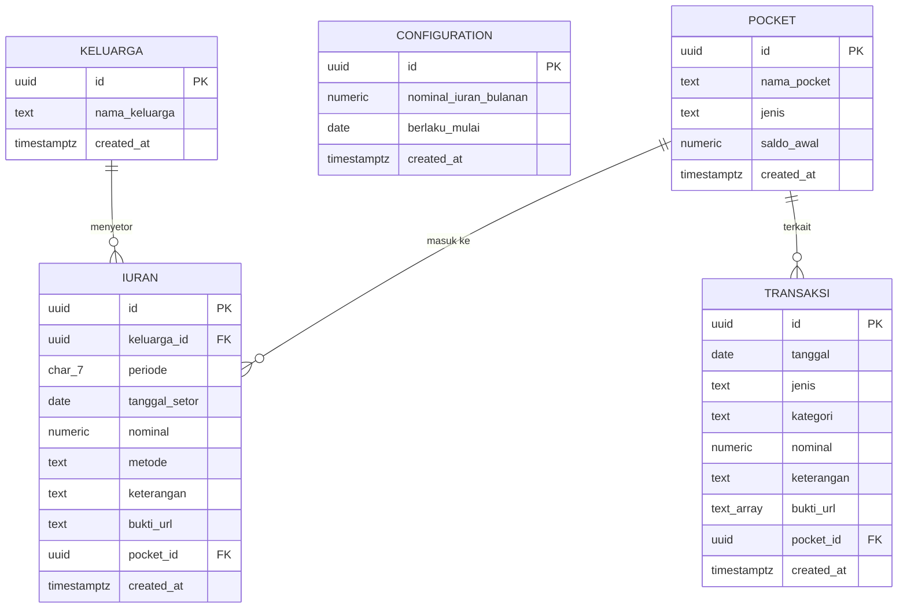

# PRD: MLAKUBARENG

**Product Requirements Document — Aplikasi Kas Keluarga Transparan**

Versi: 0.1 (Draft)
Tanggal: 2 Agustus 2026

---

## 1. Latar Belakang & Masalah

Anggota Mlaku Bareng mengumpulkan uang kas untuk keperluan rekreasi/acara keluarga, dengan target iuran per Kepala Keluarga. Saat ini pengelolaan kas rawan menimbulkan pertanyaan seperti:

- "Uangnya sudah masuk berapa?"
- "Siapa saja yang belum bayar?"
- "Dipakai untuk apa saja pengeluarannya?"
- "Ada bukti transaksinya nggak?"

**MLAKUBARENG** dibuat untuk menjawab masalah ini dengan sistem pencatatan kas digital yang transparan, bisa diakses semua anggota keluarga (bahkan publik/tanpa login untuk laporan), lengkap dengan bukti transaksi (struk/foto) dan fitur cetak laporan.

## 2. Tujuan Produk

1. Memudahkan pencatatan iuran masuk per KK secara rapi & terpusat.
2. Mencatat semua transaksi kas masuk/keluar dengan bukti (foto struk, dll).
3. Menyediakan laporan yang **transparan** — bisa dilihat semua anggota keluarga, bahkan publik, tanpa perlu login.
4. Memisahkan saldo berdasarkan tempat penyimpanan (Cash di tangan bendahara vs Bank/e-wallet).
5. Bisa dicetak/diekspor (PDF/Excel) untuk laporan pertanggungjawaban ke keluarga besar (misal saat kumpul keluarga).
6. Dibangun dengan **tech stack gratis (Rp0)** — cocok untuk skala keluarga, tidak perlu biaya server bulanan.

## 3. Akses Sistem & Entitas Data

Penting: sistem ini hanya punya **2 pihak yang mengakses aplikasi** — Admin dan Publik. **Member (KK) bukan pihak yang mengakses sistem**, melainkan **data** yang dikelola oleh Admin, sama seperti data transaksi atau data pocket.

### 3.1 Pihak yang Mengakses Sistem

| Pihak                 | Deskripsi                                               | Akses                                                                                                                                              |
| --------------------- | ------------------------------------------------------- | -------------------------------------------------------------------------------------------------------------------------------------------------- |
| **Admin / Bendahara** | Satu-satunya akun dengan login (username/password)      | Full akses: tambah/edit/hapus data member (KK), input iuran, input transaksi, upload bukti, kelola pocket, export laporan                          |
| **Publik**            | Siapa saja yang diberi link (termasuk anggota keluarga) | Tanpa login, hanya bisa **melihat** laporan transparansi (saldo, status iuran per KK, riwayat transaksi, grafik) — tidak bisa mengubah data apapun |

> Hanya ada **1 akun** di seluruh sistem, yaitu Admin. Tidak ada konsep "akun member" sama sekali.

### 3.2 Member (KK) — Entitas Data, Bukan Akun

Member/KK adalah **data** yang diinput dan dikelola sepenuhnya oleh Admin — persis seperti Admin menginput data transaksi. Member:

- Tidak login, tidak punya username/password, tidak punya sesi apapun di sistem.
- Hanya "terlihat" oleh Admin (untuk dikelola) dan Publik (untuk dilihat statusnya, lewat halaman transparansi).
- Fungsinya murni sebagai **record** untuk mengelompokkan iuran & melacak status bayar per KK.

## 4. Ruang Lingkup Fitur (Functional Requirements)

### 4.1 Manajemen Data Member (Keluarga/KK)

- Hanya **Admin** yang bisa CRUD data keluarga (tambah/edit/hapus). Ini murni input data oleh Admin — **member sama sekali tidak punya akun, username, password, atau sesi login**.
- Data keluarga cukup **Nama Keluarga** saja — tanpa nomor HP, nama perwakilan, atau field lain. Simpel: cuma daftar nama untuk mengelompokkan iuran per keluarga.
- Setiap keluarga punya halaman riwayat pembayaran (bisa dilihat publik, tidak perlu login untuk cek status "sudah/belum setor bulan ini").
- **Tidak ada konsep "target"** — yang ada adalah **nominal iuran bulanan** (default: Rp100.000/bulan), yaitu setting global yang **bisa diubah Admin kapan saja** (misal bulan depan dinaikkan jadi Rp150.000). Perubahan nominal ini tidak mengubah catatan bulan-bulan sebelumnya, hanya berlaku untuk bulan berjalan/ke depan.

### 4.2 Iuran Masuk

- Admin mencatat setoran iuran per KK per bulan: tanggal, nominal, metode (cash/transfer), keterangan, bukti transfer (opsional upload gambar).
- Status per bulan otomatis: **Sudah Setor** (jika ada catatan pembayaran bulan itu) atau **Belum Setor**.
- Karena tidak ada target/lunas-belum-lunas, sistem murni mengakumulasi total tabungan tiap KK dari bulan ke bulan.
- Rekap: total iuran terkumpul (all-time), jumlah KK yang sudah/belum setor bulan berjalan.
- Reminder (opsional, versi lanjut): notifikasi WA/email untuk KK yang belum setor bulan ini (butuh integrasi tambahan, bisa masuk fase 2).

### 4.3 Transaksi (Kas Masuk & Keluar)

- Input transaksi: tanggal, jenis (Masuk/Keluar), kategori (Iuran, Sumbangan, Konsumsi, Transportasi, Sewa Tempat, Lain-lain — bisa custom), nominal, keterangan, **upload bukti (foto struk/nota, bisa lebih dari 1 gambar)**.
- Transaksi terhubung ke Pocket (lihat 4.4) — pilih transaksi ini pakai Cash atau Bank.
- Riwayat transaksi bisa difilter: per tanggal, per kategori, per pocket, per jenis (masuk/keluar).
- Setiap transaksi keluar **wajib** ada keterangan (dan idealnya bukti) agar transparan.

### 4.4 Pocket (Cash & Bank)

- Konsep "dompet" terpisah — minimal 2 default: **Cash** (uang tunai di tangan bendahara) dan **Bank/E-wallet** (rekening/DANA/OVO, dll).
- Bisa tambah pocket baru jika perlu (misal: "Rekening BCA", "DANA Bendahara").
- Setiap pocket punya saldo berjalan otomatis (dihitung dari transaksi masuk-keluar).
- Fitur **transfer antar pocket** (misal: setor cash ke bank) — dicatat sebagai 1 transaksi khusus, tidak menambah/mengurangi total kas keseluruhan.
- Dashboard menampilkan saldo total & saldo per pocket.

### 4.5 Transparansi Publik

- Halaman publik (tanpa login) berisi:
  - Total saldo kas saat ini (per pocket & total).
  - Total iuran terkumpul (all-time, akumulasi tabungan seluruh KK).
  - **Tabel status setoran per KK per bulan**, contoh bentuknya:

    | Nama KK       | Agu 2026       | Jul 2026     | Jun 2026     | Total Terkumpul |
    | ------------- | -------------- | ------------ | ------------ | --------------- |
    | Keluarga Budi | ✅ Rp100.000   | ✅ Rp100.000 | ✅ Rp100.000 | Rp300.000       |
    | Keluarga Andi | 🔴 Belum Setor | ✅ Rp150.000 | ✅ Rp100.000 | Rp250.000       |

  - Ringkasan visual di atas tabel (misal: "X dari Y KK sudah setor bulan ini").
  - Riwayat transaksi masuk-keluar terbaru (dengan keterangan, tanpa perlu tampilkan bukti foto ke publik jika ingin lebih privat — atau ditampilkan semua jika keluarga sepakat full transparan).

- Link halaman ini bisa dibagikan lewat WA grup keluarga, tanpa perlu install apapun.

### 4.6 Cetak / Export Laporan

- Export ke **PDF**: laporan rekap (misal: Laporan Kas Bulan Juli 2026) — cocok untuk dibagikan/dicetak fisik saat kumpul keluarga.
- Export ke **Excel/CSV**: data mentah transaksi & iuran untuk siapa yang mau olah data sendiri.
- Filter export: per rentang tanggal, per pocket, atau all-time.

## 5. Alur Pengguna Utama (User Flow Singkat)

1. **Admin login** (satu-satunya akun) → Dashboard → Tambah KK baru saat ada keluarga gabung.
2. **Admin login** → Input iuran KK yang baru bayar → Sistem update status KK & saldo pocket.
3. **Admin catat pengeluaran** → Pilih pocket → Upload foto struk → Simpan → Saldo pocket otomatis berkurang.
4. **Siapa saja** (termasuk anggota keluarga, tanpa akun/login apapun) buka link publik → Lihat saldo, status iuran per KK, & riwayat transaksi.
5. **Sebelum acara kumpul keluarga**, admin export laporan PDF → cetak/kirim ke grup WA.

## 6. Model Data (ERD)

### Penjelasan Tabel

| Tabel           | Fungsi                                                                                                                                    |
| --------------- | ----------------------------------------------------------------------------------------------------------------------------------------- |
| `keluarga`      | Data keluarga (member) — dikelola penuh oleh Admin, bukan akun                                                                            |
| `configuration` | Riwayat nominal iuran bulanan; tiap perubahan nominal jadi baris baru dengan `berlaku_mulai`, sehingga histori nominal lama tidak berubah |
| `pocket`        | Dompet kas (Cash, Bank, dll); saldo dihitung otomatis lewat view, bukan kolom statis                                                      |
| `iuran`         | Catatan setoran per keluarga per bulan (`periode` format `YYYY-MM`); status "Sudah/Belum Setor" dicek dari ada/tidaknya baris di sini     |
| `transaksi`     | Catatan kas masuk/keluar umum (di luar iuran), lengkap dengan bukti foto — murni dicatat Admin, tidak terikat ke keluarga tertentu        |

> **Login Admin**: tidak ada lagi tabel `admin` manual — login memakai **Supabase Auth bawaan** (`auth.users`). Ini lebih aman (password hashing, session, dsb sudah ditangani Supabase) dan menyederhanakan skema.

> Saldo tiap pocket **tidak disimpan sebagai angka statis**, melainkan dihitung otomatis (via SQL view) dari akumulasi `saldo_awal` + semua `iuran` masuk + `transaksi` masuk − `transaksi` keluar pada pocket tersebut. Ini menghindari data saldo yang "telat update" atau tidak sinkron.

File migration SQL awal (siap jalan di Supabase) tersedia di lampiran: `001_init.sql`.

## 7. Non-Functional Requirements

- **Mobile-friendly**: mayoritas anggota keluarga akan akses dari HP.
- **Ringan & cepat**: tidak perlu instalasi, cukup buka link browser.
- **Aman**: upload gambar bukti disimpan aman, data keuangan tidak bisa diedit sembarangan oleh non-admin.
- **Gratis dioperasikan**: tidak ada biaya server bulanan (lihat rekomendasi stack di bawah).
- **Skalabilitas kecil**: didesain untuk puluhan-ratusan KK, bukan ribuan — jadi free tier layanan cloud akan lebih dari cukup.

## 8. Rekomendasi Tech Stack (Target: Rp0)

| Komponen                  | Rekomendasi                                                                       | Kenapa Gratis                                                                                                                   |
| ------------------------- | --------------------------------------------------------------------------------- | ------------------------------------------------------------------------------------------------------------------------------- |
| Frontend                  | **Next.js** (React)                                                               | Open source, gratis                                                                                                             |
| Hosting Frontend          | **Vercel** (free tier)                                                            | Deploy otomatis dari GitHub, gratis untuk trafik skala kecil                                                                    |
| Database + Auth + Storage | **Supabase** (free tier)                                                          | Postgres DB gratis (500MB), Auth bawaan, Storage gratis 1GB untuk upload foto bukti — satu platform untuk 3 kebutuhan sekaligus |
| Export PDF                | **jsPDF / @react-pdf/renderer**                                                   | Library JS open source, generate PDF langsung di browser                                                                        |
| Export Excel              | **SheetJS (xlsx)**                                                                | Library JS open source untuk generate file Excel                                                                                |
| Version Control           | **GitHub** (free, repo publik/privat gratis)                                      | Untuk simpan source code & auto-deploy ke Vercel                                                                                |
| Domain                    | Gunakan subdomain gratis dari Vercel (`mlakubareng.vercel.app`) di awal       | Custom domain (`.com`) berbayar ±Rp150rb/tahun jika mau upgrade nanti                                                           |
| Keep-Alive (wajib)        | **Vercel Cron Job**, dijalankan **harian**, melakukan query sederhana ke Supabase | Mencegah project Supabase di-pause otomatis karena inaktivitas                                                                  |

> Dengan kombinasi ini, total biaya operasional = **Rp0/bulan** selama trafik & penyimpanan masih dalam batas free tier (untuk skala kas keluarga, ini sangat cukup — biasanya baru perlu upgrade kalau sudah ratusan ribu transaksi atau puluhan GB foto).

> ⚠️ **Catatan penting — Supabase Free Tier Auto-Pause**: Project Supabase di tier gratis akan **otomatis di-pause setelah 7 hari tanpa aktivitas** (tidak ada query database/API request). Ini berisiko untuk aplikasi kas keluarga yang mungkin jarang diakses (misal saat tidak ada acara/rekreasi dalam waktu dekat). Data tidak hilang saat di-pause, tapi aplikasi tidak bisa diakses sampai di-restore manual dari dashboard Supabase (butuh beberapa saat untuk bangun kembali).
>
> **Mitigasi**: Wajib pasang **Vercel Cron Job** yang berjalan **setiap hari**, melakukan query kecil (misal `SELECT` ringan) ke database Supabase — jauh lebih sering dari batas 7 hari, jadi jauh lebih aman. Vercel Cron Job gratis untuk kebutuhan seperti ini (tier gratis Vercel mendukung cron job harian). Setup ini sekali kerja di awal development, setelahnya berjalan otomatis tanpa perlu diurus lagi.

## 9. Roadmap Fase Pengembangan (Saran MVP)

**Fase 1 — MVP (Inti)**

- Manajemen Member
- Input Iuran + status sudah/belum setor per bulan
- Input Transaksi + upload bukti
- Pocket (Cash & Bank) + saldo otomatis
- Halaman publik transparansi (read-only)
- Export PDF & Excel

**Fase 2 — Pelengkap**

- Grafik/chart visual (progress setoran per bulan, tren pengeluaran per kategori)

**Fase 3 — Nice to have**

- Notifikasi WA otomatis untuk KK yang belum setor bulan ini
- Multi-event/multi-kas (misal kas rekreasi vs kas dukacita, dipisah)
- Approval 2 tingkat (misal transaksi besar butuh approve 2 admin)

## 10. Hal yang Perlu Didiskusikan Lagi (Open Questions)

- Nominal iuran bulanan: apakah sama rata untuk semua KK, atau boleh beda-beda per KK (misal ada yang sanggup lebih)?
- Apakah butuh multi-kas (terpisah per event) atau cukup 1 kas berkelanjutan?

---

_Dokumen ini adalah draft awal — siap dikembangkan lebih lanjut menjadi wireframe/mockup UI atau spesifikasi teknis (database schema detail, API endpoints) jika dibutuhkan._

## ROUTING

/
│
├── / # Landing Page
├── /laporan # Transparansi Kas (Publik)
│
├── /login # Login Admin
│
└── /dashboard # Dashboard Admin
│
├── /dashboard
│
├── /dashboard/keluarga
├── /dashboard/keluarga/tambah
├── /dashboard/keluarga/[id]
├── /dashboard/keluarga/[id]/edit
│
├── /dashboard/iuran
├── /dashboard/iuran/tambah
├── /dashboard/iuran/[id]
├── /dashboard/iuran/[id]/edit
│
├── /dashboard/transaksi
├── /dashboard/transaksi/tambah
├── /dashboard/transaksi/[id]
├── /dashboard/transaksi/[id]/edit
│
├── /dashboard/pocket
├── /dashboard/pocket/tambah
├── /dashboard/pocket/[id]
├── /dashboard/pocket/[id]/edit
│
├── /dashboard/laporan
│
└── /dashboard/settings
